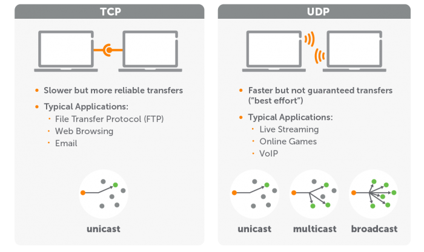
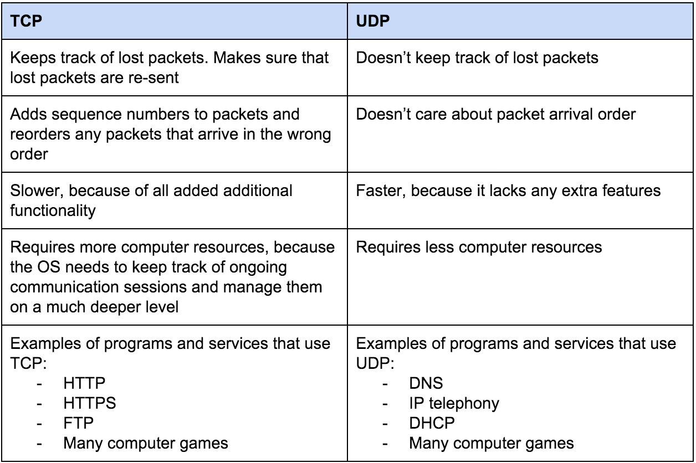

# System Design Overview

## System Requirements:

### Ask clarifying questions to understand the problem and expectations of the Client.

1. **Requirement Classifications**:
   - Use cases
   - Scenarios that will not be covered
   - Who will use
   - How many will use
   - Usage patterns
   - Technology stack

### Functional Requirements:

- Start with the customer and work base
- Who will use the system
- How will the system be used
- Platform based (mobile, web, desktop)

### Non-Functional Requirements:

- **High availability system uptime** in percentage:
  - 99% => 3.65 days of downtime per year
  - 99.9% => 8.76 hours of downtime per year
  - 99.99% => 52 minutes 35 seconds of downtime per year
  - 99.999% => 5 minutes 15 seconds of downtime per year
  - 99.9999% => 31 seconds of downtime per year
- **Scalability** to handle peak load times
- **Performance** in terms of latency and throughput
- **Durability** – data should not be lost
- **Consistency** – data should not be corrupted
  - Strong consistency
  - Weak consistency
- **Maintainability**
- **Failure modes and mitigations**
- **Monitoring**
- **Testing**
- **Deployment**
- **Security**
- **Cost**

## System Design Syllabus:

### 1. Foundational Concepts

- **Client-Server Model**: Basics of how clients and servers communicate. Request/response patterns (REST, RPC, WebSockets).
- **Networking Basics**: TCP/IP, UDP, HTTP/HTTPS, DNS, CDN, Load Balancers, HTTP/2, HTTP/3.
- **Databases**:
  - RDBMS (MySQL, PostgreSQL).
  - NoSQL: Key-Value stores (Redis, DynamoDB), Document stores (MongoDB, Couchbase), Wide-column stores (Cassandra), Graph DBs.
  - ACID vs BASE properties.
  - CAP Theorem: Consistency, Availability, Partition tolerance.
- **Caching**: Client-side, CDN caching, Web server caching, Database caching.
  - Cache strategies: Cache aside, Write-through, Write-behind.
  - Eviction policies: LRU, LFU, FIFO.
- **Message Queuing & Asynchronous Processing**: Message Brokers (Kafka, RabbitMQ, SQS). Event-driven architecture. Asynchronous messaging patterns.
- **Latency and Throughput**: Definitions, measurement, and impact on design. Strategies for balancing latency and throughput.

### 2. Core System Design Patterns

- **Scalability**: Horizontal vs Vertical scaling, Load balancing (Active-Active, Active-Passive), Auto-scaling, Elasticity.
- **Consistency**: Strong, Eventual, Weak consistency, Distributed transactions, two-phase commit.
- **Availability**: High availability design, Failover strategies, Replication and partitioning.
- **Partitioning & Sharding**: Horizontal vs Vertical data partitioning, Database sharding (range-based, hash-based, composite), Federation.

### 3. Architecture Design

- **Monolithic vs Microservices**: Benefits and challenges, Transitioning to microservices, Service discovery, API gateways.
- **Service-Oriented Architectures (SOA)**: Core principles, Request-response, Publish-subscribe.
- **High-Level Design Diagrams**: Architecture diagrams, Documenting design (UML, ERD, Flow diagrams).
- **API Design**: RESTful API, GraphQL vs REST, Rate limiting, Pagination, Versioning.
- **Data Flow Design**: Data flow diagrams, Workflow for read/write-heavy systems.

### 4. Infrastructure & DevOps

- **Cloud Architecture**: IaaS, PaaS, AWS, Google Cloud, Azure, Serverless architecture (Lambda, Azure Functions).
- **CI/CD**: CI/CD pipelines, Automated testing, Rollback mechanisms.
- **Infrastructure as Code (IaC)**: Tools like Terraform, CloudFormation.
- **Monitoring & Logging**: Tools (Prometheus, Grafana, New Relic), ELK Stack (Elasticsearch, Logstash, Kibana), Alerts and response systems.
- **Disaster Recovery & Backups**: Backup strategies, Multi-region disaster recovery.

### 5. Advanced Topics

- **Designing for High Traffic Systems**: Traffic estimates (QPS, read/write ratios), Peak load management, Performance testing.
- **Distributed Systems**: Consensus algorithms (Paxos, Raft), Leader election, Replication, Fault tolerance, Distributed file systems (Google File System, HDFS).
- **Event-Driven Architecture**: CQRS, Event sourcing, Eventual consistency.
- **Security in System Design**: Authentication/Authorization (OAuth, JWT, SAML), Data encryption (In-transit, At-rest), Mitigating attacks (DDoS, SQL Injection, XSS).

---

## Network Basics:

1. **TCP and UDP**:
   - **TCP**: Reliable, connection-oriented, ordered data transmission.
   - **UDP**: Fast, connectionless, unordered data transmission.

## OSI Models:

#### what is osi model

It is a framework that explains the process of transmitting data between computers.

#### Different Layers of Computer Network

##### **1. Physical Layer** :

- This layer adds **start and end delimiters** to the message(This delimeters tells where the message starts and end)
- This layer also encodes the message based on the time interval and the voltage. (We send information through bits i.e., 0 and 1. So we use voltage to denote 0 and 1 in hardware components. Peak voltage means 1 and no voltage means 0).
- Computers must agree on a contract to understand the encoded message.

##### **2. Routing Layer** :

- The process of sending message source to destination using intermediaries is known as routing. This layer is not strictly compulsory, because if some computer is listening on the physical layer, then they receive the message. However, it is useful when we know where to send the message because we don't need to broadcast the message to all systems.
- When sending the message, the sender also includes the receiver's address in the message. This message is then picked up by the router, it decodes the address and sends the message to the correct computer.

- To route the message to the correct computer and receive messages back we need
  - **MAC Address** : This is like the identity of the computer system. It is permanent.
  - **IP Address** : This is a virtual/logical/temporary address.

##### **3. Behavioral Layer** :

- This layer defines the conversation settings between two computers. This layer answers questions like

  - How frequently can one computer send messages to another?
  - Can the receiver after receiving a message, send a reply to sender?
  - Can the receiver send a message without receiving any message?

- So we are defining the frequency, directions and context of messages in this layer.

##### **4. Application Layer** :

- This layer should helps the software applications.

### Different Layers of Computer Network

##### Connecting to the internet: ISPs, DNS and everything in between

- So what happens when we enter a URL (let's say https://flipkart.com ) in our browser

- First, the computer sends the **NIC(Network Interface Card)**. This hardware component allows the computer to connect the internet.
- The NIC allows the computer to connect the router.
- The Router does not know where the https://flipkart.com is, so ask the central authority. This central authority maps addresses to their IP Address. This central authority has a set of servers that help to find the IP Address (which is known as Internet Backbone). This is also known as **Domain Name Server**.
- A **Domain Name Server** handles the mapping of a business domain name to an IP Address. But how does this central authority know where https://flipkart.com is? The configuration is done by InterviewReady on the servers.

