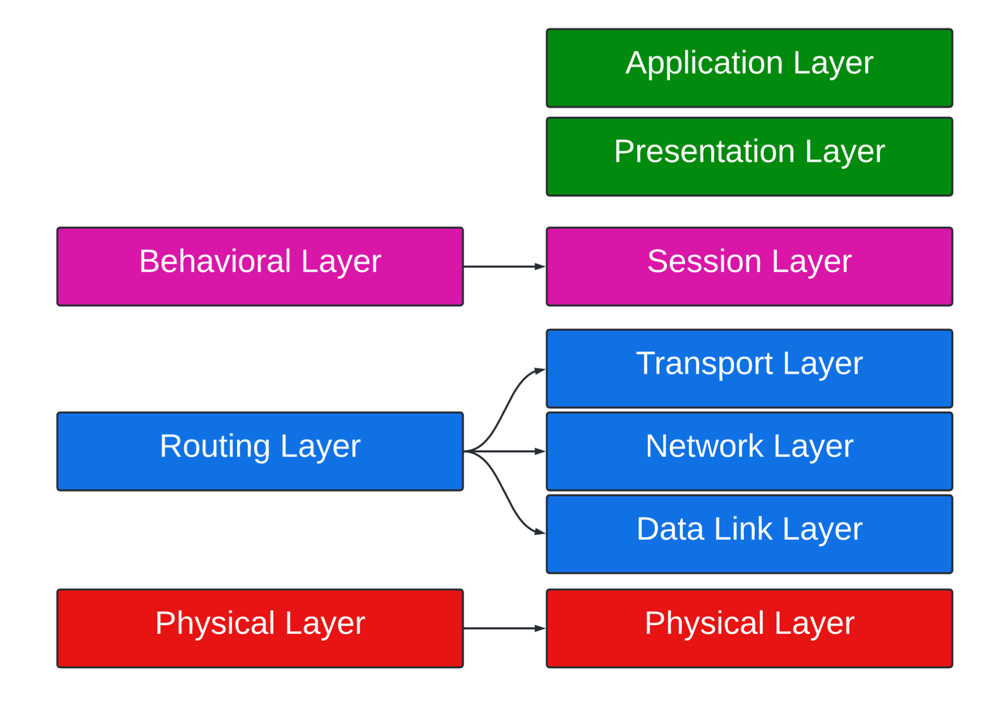
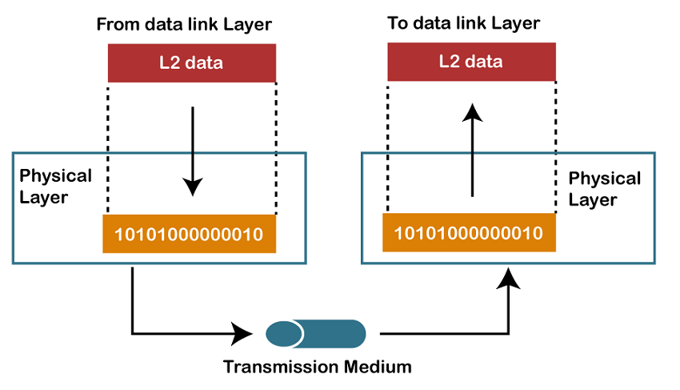
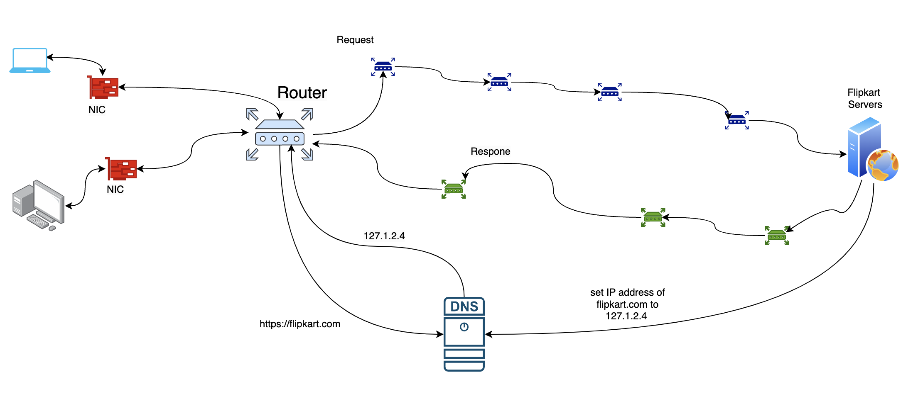
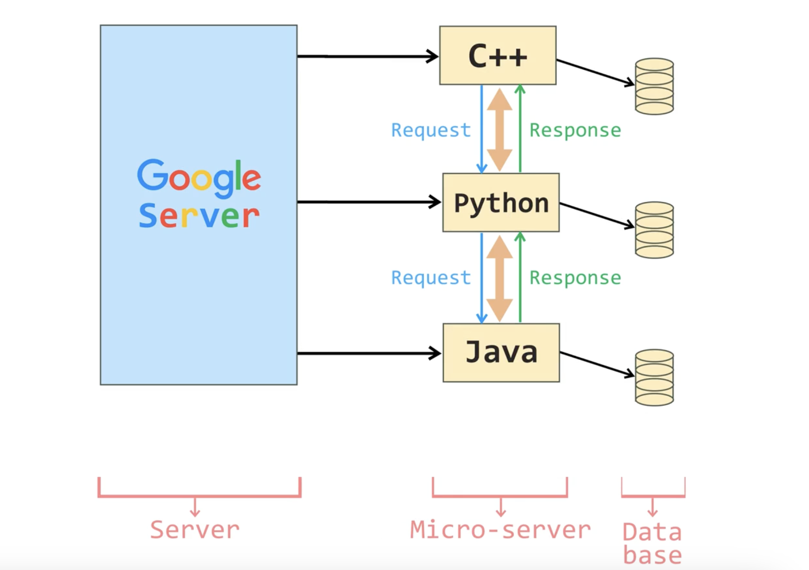
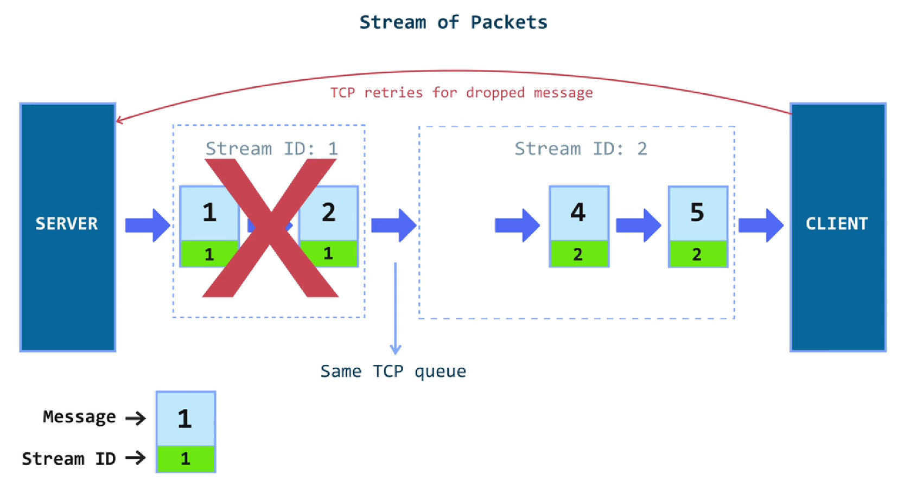

# System Design Overview
# syllabus:
1. [Networking](#networking-modules)

---

## Networking Modules
- [OSI model](#osi-models)
- [Different Layers of Computer Network](#different-layers-of-computer-network)
- [CDN](#content-delivery-network)
- [Internal Routing](#internal-routing-mac-addresses-and-nat)
- [Communication between Router to Server](#communication-between-router-to-server)
- [Communication Standards](#communication-standards-rest-graphql-and-gprc)
- [Protocols for video transmission](#protocols-for-video-transmission)

### OSI Models:

#### what is osi model

It is a framework that explains the process of transmitting data between computers.

#### Different Layers of Computer Network

##### **1. Physical Layer** :

- This layer adds **start and end delimiters** to the message(This delimeters tells where the message starts and end)
- This layer also encodes the message based on the time interval and the voltage. (We send information through bits i.e., 0 and 1. So we use voltage to denote 0 and 1 in hardware components. Peak voltage means 1 and no voltage means 0).
- Computers must agree on a contract to understand the encoded message.

##### **2. Routing Layer** :

- The process of sending message source to destination using intermediaries is known as routing. This layer is not strictly compulsory, because if some computer is listening on the physical layer, then they receive the message. However, it is useful when we know where to send the message because we don't need to broadcast the message to all systems.
- When sending the message, the sender also includes the receiver's address in the message. This message is then picked up by the router, it decodes the address and sends the message to the correct computer.

- To route the message to the correct computer and receive messages back we need
  - **MAC Address** : This is like the identity of the computer system. It is permanent.
  - **IP Address** : This is a virtual/logical/temporary address.

##### **3. Behavioral Layer** :

- This layer defines the conversation settings between two computers. This layer answers questions like

  - How frequently can one computer send messages to another?
  - Can the receiver after receiving a message, send a reply to sender?
  - Can the receiver send a message without receiving any message?

- So we are defining the frequency, directions and context of messages in this layer.

##### **4. Application Layer** :

- This layer should helps the software applications.

### Different Layers of Computer Network

##### Connecting to the internet: ISPs, DNS and everything in between

- So what happens when we enter a URL (let's say https://amazon.com ) in our browser

- First, the computer sends the **NIC(Network Interface Card)**. This hardware component allows the computer to connect the internet.
- The NIC allows the computer to connect the router.
- The Router does not know where the https://amazon.com is, so ask the central authority. This central authority maps addresses to their IP Address. This central authority has a set of servers that help to find the IP Address (which is known as Internet Backbone). This is also known as **Domain Name Server**.
- A **Domain Name Server** handles the mapping of a business domain name to an IP Address. But how does this central authority know where https://amazon.com is? The configuration is done by Filpkart on the servers.

- After the router gets the IP Address, it connects to the amazon Server through Network Protocol. To put it simply we go from router to router and every router. At every router, we get the
  address of the next router, which finally gets us to the amazon Server.

- Our router will also get a response similarly.

##### Few points on Network Security?

1. Our router gets the IP Address from the DNS, so why can't someone intercept the message and send a fake IP Address?

- It is only possible if someone gets physical access to the router and configures it so that it connects to his/her DNS.

2. While sending requests and receiving responses, can a router in between redirect it to different servers or send malicious data?

- It is only possible if you can convince the Internet Backbone that your router is genuine.

### Content Delivery Network

- To reduce the response time, servers usually cache the response for a request, so when the same request comes in it can send the response from the cache. However, this is also wasteful. Ideally, clients should store the data on their local computers. But the issue with this approach is that the data can become outdated.
- To overcome these issues, we use **CDN**.

- In simple terms **CDN** is a set of cache distributed across the globe. So instead of sending requests to the main server, clients can send to the nearest **CDN**.

  - It saves bandwidth because CDNs are located near the client.
  - It also faster.
  - If the main server wants to update the data, it can send the request to the CDN.

### Internal routing: MAC addresses and NAT

- Once the router gets the response, it also needs to decode it. There can be multiple users can be connected with same router, so it must be send to the right user.

##### There are two main methods to implements this:

- **The Router has a mapping of the sender request and the domain requested.**

  - We can have a mapping of the request ID and the MAC address of the device. Once the router gets the response it can send the response to the correct device.

  - However, there is a security issue with this approach. If someone gets access to the router. Then they can change the MAC Address and redirect the response to their device.

- **The Router sends the sender address when sending the request**

  - We use Network Address Translation. The main idea behind this approach is, that every device has a unique identifier **inside its network**. Generally, Virtual IP Addresses are used as they are unique in their network and we do not need to depend on the physical address of the device. Now we send this virtual IP Address along with the message. Since this Virtual IP Address is unique in its network only, anyone else outside of the network cannot connect with the devices. This is known as Network Address Translation.

### Communication between Router to Server

#### HTTP

- The common way to send requests and recieve responses through **HTTP**. HTTP stands for **Hyper Text Transmission Protocol**.

1. It is **stateless**. It means every HTTP request the server receives is independent and does not relate to requests that came before it.
2. It is a **Client-Server** protocol. There is a clear definition of the server and the client. Every client request will have an ID to which the server responds. In this protocol, the server cannot send a request to the client.

#### WebSockets

- So HTTP only allows unidirectional communication. If we want bi-directional communication we can
  use **WebSockets**.
- It allows for **Peer-to-Peer** communication. So it establishes a duplex connection allowing both devices to send and receive requests.

- You can also use **XMPP** (Extensible Messaging and Presence Protocol) which is an open XML Technology for real-time communication.

#### TCP and UPD

- Both Http and websockets use **TCP**. It stands for **T**ransmission **C**ontrol **P**rotocol.
- TCP provides features like

  1. It ensures **Guaranteed Delivery**. Whenever the receiver gets our message. we get an acknowledgment. This makes sure our message delivers.
  2. It ensures **the ordering of messages**. Since we wait for the acknowledgment, before sending the next message, it maintains the ordering of messages.
  3. It also **retries**, when there is a failure. To process the message only once, the receiver can keep a track of the message ID. If the message ID is already processed, it can send the acknowledgment that it received the message but won't process it.

- We also have another protocol known as **UDP**. It stands for User Datagram Protocol. Unlike TCP it does not have the above three features. It is mainly used in Real-Time Delivery.

### Communication Standards: REST, GraphQL and GPRC

- In a microservice architecture, services needs to communicate with each other. They send data in the form of an objects. Different Services can use different languages, so they must be common intermediate language for defining objects. Once the language is defined we need to query the data. There are two common techniques:
  

#### Rest

- It is a **very common protocol and is used over the HTTP**.
- It is a **stateless** because rather than relying on the server to remember the previous requests, REST applications require each request to contain all of the information necessary for the server to understand it.
- Requests are **Cacheable**.

#### GRAPHQL

- In GraphQL we can request the specific attributes. So it saves bandwidth and also provides
  security.

#### gRPC

- (google Remote Procedure Call) is generally used by microservices to communicate internally.
  It is written over **HTTP 2.0**.

### Head-of-Line Blocking in HTTP

- Let's understand this using an example.
- Suppose we have two devices A and B

  - First A sends message to B.
  - B fails to processing the message (or maybe it fails to send an acknowledgment).
  - Since A did not get back any acknowledgment, A keeps retrying until B sends an acknowledgment.
  - Other messages in A's queue are going to be waiting (because of ordered delivery).

- So in simple terms, **Head-Of-Line blocking occurs when the message/data packet at the head of
  the queue cannot move forward due to congestion even if other messages/packets behind this
  one could.**

- HTTP 2.0 solves this problem using **Multiplexing**. It implements multiplexing by **breaking the
  messages/data packets into frames** and are sent in streams. Each stream has a stream ID. So,
  when you get a message of a stream ID, that stream is going to be blocked until all the messages
  having the stream IDs are processed.

- HTTP 2.0 solved Head of Line Blocking, but it is still written over TCP. Even though data packets are broken into logical streams, they are not independent because they are running on the same TCP queue. If there was a drop-in packet in one of the streams, other streams will still be blocked.

- Consider the example below, you have two streams with stream IDs 1 and 2. Even if one packet in
  stream 2 was dropped, stream 1 is also blocked.

- To solve this problem, HTTP 3.0 uses UDP instead of TCP. It used UPD because there are no acknowledgments. It provides streams, ordered delivery and all other features of HTTP 2.0. HTTP 3.0 will be called QUIC.

### Protocols for video transmission

- Video files are large and cannot be sent in a single response. They have to be broken into packets. Also, using HTTP to send video files is very inefficient.

- HTTP is not good for video transmission because:

  - Videos are broken into chunks. Since HTTP is stateless, the client has to specify which chunk it wants because the server does not know about the previous requests.

  - HTTP is written over TCP which is not optimal for live streaming. Because in live streaming, if the video packet does not reach the client then there is no point in retrying because the data is old. So UDP is better for live-streaming. However, in some cases where we need, guaranteed delivery TCP is preferred.

#### HTTP-DASH

- DASH stands for Dynamic Adaptive Streaming over HTTP
- This protocol runs over TCP. So there is guaranteed delivery and ordering.
- The basic idea is, that the client sends a signal to the main server based on the data you can handle.
- For example, if the client can handle a video up to 720p resolution then the main server will send the client a video up to 720p resolution. If the client's network is very slow then the main server will send videos in lower resolution to maintain connectivity.

- In Mac devices, HLS is used. It is very similar to HTTP-DASH.

#### Web-RTC
- For video conferencing, sending video streams to the other client through a server is a bad idea because:

  - It will increase the network congestion on the server-side.
  - Video streaming will be slow.
  - The server acts as a single point of failure.

- So to solve these issues we use WebRTC.
- It is a peer-to-peer protocol so no server is required to send data.

##### How does peer-to-peer communication work?

- First, the clients get the addresses of the other clients from the server.
- Then the server sends the information to both the clients.
- Clients use this information to connect.

Since it does not require a server

- It is fast.
- It saves bandwidth.
- It is more robust because even if the server crashes, clients can keep talking to each other.

